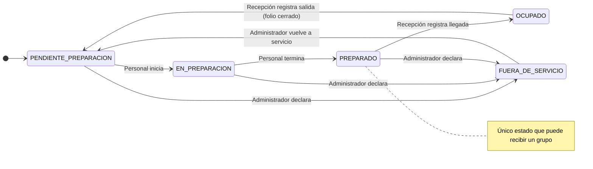

# Anexo B. Preguntas guía para definir el alojamiento

**Alojamiento:** Stayly-UQ · Armenia, Quindío

**Integrantes:** Juan Esteban Piñeros Maldonado (C.C. 1094899864) · Miguel Ángel Betancourt Carmona (C.C. 1090273851)

Universidad del Quindío · Facultad de Ingeniería · Ingeniería de Sistemas y Computación · Programación Avanzada · Armenia, 2026-2

Este anexo responde las preguntas guía como lo haría el dueño de Stayly-UQ en una sesión de levantamiento de requisitos. Cada respuesta justifica un valor de la Ficha (Anexo A) y dice qué hace el negocio cuando la regla no se cumple.

## B.1 Inventario

**¿Cuántos apartamentos hay y cómo los identifica el negocio?**

Son 6 apartamentos en un edificio de tres pisos. El negocio los identifica con el código SUQ- seguido del piso y el número: SUQ-101 y SUQ-102 en el primer piso, SUQ-201 y SUQ-202 en el segundo, SUQ-301 y SUQ-302 en el tercero. El código es único, no cambia nunca y es el que aparece en reservas, tarifas, bloqueos y novedades. Si se escribe en minúsculas (suq-201) se entiende como el mismo apartamento.

**¿Qué diferencia a uno de otro?**

Los diferencian la capacidad, el número de dormitorios, la dotación y si admiten mascotas. Hay tres tamaños: 1 dormitorio para 2 personas (piso 1), 2 dormitorios para 4 (piso 2) y 3 dormitorios para 6 (piso 3). En cada piso uno admite mascotas y otro no: las admiten SUQ-102 (patio interior), SUQ-202 (terraza privada) y SUQ-301 (lavadora y piso fácil de limpiar). La dotación de cada uno está en la Ficha (Anexo A, A.2): SUQ-101 tiene balcón con vista a la ciudad, SUQ-201 escritorio y wifi de alta velocidad para trabajo remoto, y SUQ-302 vista panorámica a la cordillera y dos baños.

**¿Por qué alguien pagaría más por uno que por otro?**

La tarifa es por ocupante facturable, así que lo que se paga de más es el valor agregado del apartamento, no su tamaño. SUQ-101 ($95.000 en base) cuesta más que SUQ-201 ($75.000) porque es para parejas y tiene balcón con vista a la ciudad. SUQ-302 es el más caro en temporada alta ($130.000) por la vista panorámica a la cordillera. SUQ-301 es el más barato por persona ($65.000) porque está pensado para grupos grandes que comparten el valor.

**¿Alguno tiene limitaciones de acceso que deban advertirse al reservar?**

Sí. SUQ-301 y SUQ-302 están en el tercer piso y el edificio no tiene ascensor; eso se advierte al huésped antes de confirmar la reserva (advertencia de acceso del apartamento). SUQ-102 es el único sin escaleras, apto para movilidad reducida. Si un huésped con movilidad reducida pide un apartamento del tercer piso, recepción le ofrece SUQ-102 o un apartamento del segundo piso; el sistema no lo impide, solo lo advierte.

## B.2 Reserva

**¿En qué momento una consulta se vuelve una reserva en firme?**

Una cotización no reserva nada: solo muestra el valor noche por noche. Al crear la reserva, las noches quedan apartadas y la reserva nace **pendiente**. Pasa a **confirmada** (en firme) cuando se cumplen dos condiciones: el titular indicó su hora estimada de llegada y el folio tiene pagado el anticipo del 30 % del valor del alojamiento. Si falta cualquiera de las dos, la reserva no se confirma. El titular recibe un correo cuando la reserva se crea y cuando se confirma; si el correo falla, la reserva igual queda guardada (Anexo A, A.6).

**¿Cuánto tiempo se espera a que alguien confirme antes de liberar las fechas?**

24 horas desde que se creó la reserva. Es tiempo suficiente para hacer una transferencia o pasar por recepción, sin bloquear fechas que otro cliente sí pagaría. Si en 24 horas no se confirma, el sistema la cancela solo y las noches quedan libres de inmediato, sin que nadie de recepción intervenga. No hay retención porque no se había pagado el anticipo.

**¿Se pueden cambiar fechas después de confirmar?**

Sí, mientras la reserva no haya iniciado (pendiente o confirmada). Lo hace recepción, no el huésped desde el portal. El cambio se trata como una reserva nueva para las validaciones: se vuelven a revisar disponibilidad, capacidad, bloqueos, tiempo de preparación, estancia mínima y mascotas, sin chocar con la propia reserva. El valor se recalcula con las tarifas vigentes y la diferencia queda en el folio como ajuste, a favor o en contra del huésped. La política de cancelación no cambia: sigue la que se congeló al crear. Si las nuevas fechas no están disponibles, el cambio se rechaza y la reserva queda como estaba.

**¿Qué se hace cuando llegan más personas de las anunciadas?**

Solo se aloja a los ocupantes registrados (norma de convivencia) y la capacidad es un tope rígido. Si con las personas adicionales el grupo sigue dentro de la capacidad, recepción modifica la reserva, registra a los nuevos ocupantes y el folio recibe el ajuste por los nuevos facturables. Si el grupo supera la capacidad, recepción ofrece cambiar a un apartamento más grande disponible para las mismas fechas; si no lo hay, las personas adicionales no se alojan. Nunca se registra a más personas que la capacidad del apartamento.

## B.3 Llegada y salida

**¿Cuáles son las horas de entrada y salida?**

Entrada a las 15:00 y salida a las 12:00. La salida al mediodía le deja al huésped la mañana libre; la entrada a las 15:00 deja una ventana de 3 horas que es exactamente el tiempo de preparación. Por eso se puede vender una entrada el mismo día de una salida en el mismo apartamento.

**¿Qué pasa si el huésped quiere llegar antes o irse después?**

Llegar antes de las 15:00 es posible solo si el apartamento ya está marcado como preparado; si no, el grupo espera, porque nunca se entrega un apartamento sin preparar. Lo que no se permite es registrar la llegada antes de la fecha de entrada de la reserva. Irse después de las 12:00 solo se acepta si ese día no llega otro grupo al apartamento, porque se comería el tiempo de preparación; si hay una llegada, la salida es a las 12:00. Llegar de noche sí cambia el precio: si la hora estimada es a las 21:00 o después, se registra el recargo por llegada nocturna de $30.000 (RP-03), una sola vez. Si el huésped cambia su hora estimada a una anterior a las 21:00 antes de llegar, el recargo se revierte con un movimiento inverso en el folio.

**¿Hasta qué hora se espera a alguien antes de dar la reserva por perdida?**

Hasta las 23:00 del día de entrada, que es la hora hasta la que hay recepción en el edificio. Desde esa hora, recepción puede declarar la reserva como no-show: se retiene el 30 % del valor de la reserva, que equivale al anticipo, y las noches se liberan de inmediato. Antes de las 23:00 no se puede declarar no-show. Una reserva en no-show no se reactiva: si el grupo aparece después, se crea una reserva nueva si hay disponibilidad.

**¿Qué se revisa antes de dar por cerrada una estancia?**

Dos cosas. Primero, el apartamento: el personal revisa la dotación y, si encuentra un daño o un faltante, lo registra como novedad con su gravedad. Si genera un cobro, recepción lo carga al folio. Segundo, el folio: debe quedar con saldo en cero. Si queda saldo y el huésped no puede pagarlo, el folio solo se cierra con autorización del administrador, que deja registrado quién autorizó y por qué. Sin folio cerrado no se registra la salida. Al registrarla, la reserva queda finalizada y el apartamento pasa a pendiente de preparación.

## B.4 Dinero

**¿Cómo se calcula el precio de una estancia?**

Noche por noche: para cada noche se toma la tarifa del apartamento en la temporada de esa noche y se multiplica por los ocupantes facturables. El valor del alojamiento es la suma de todas las noches. A eso se suman, en el folio, los cargos que correspondan: mascotas ($25.000 por mascota por noche), recargo por llegada nocturna ($30.000) y los servicios adicionales que el huésped pida: desayuno típico ($18.000 por persona por día), parqueadero ($15.000 por noche, cupo limitado), lavandería ($20.000 por carga) y traslado a la terminal o al aeropuerto El Edén ($60.000 por trayecto). Todo es en pesos colombianos sin decimales y se redondea al final de cada cargo, nunca noche por noche. El valor queda congelado al crear la reserva: si después cambia la tarifa, las reservas ya creadas no se afectan.

**¿Desde qué edad se cobra como adulto?**

Desde los 12 años cumplidos a la fecha de entrada. Un menor de 12 ocupa cupo de capacidad pero no genera cargo. Si cumple 12 durante la estancia, no se le cobra, porque la edad se mide el día de entrada. El titular siempre debe tener 12 años o más; si no, la reserva se rechaza.

**¿Cuáles son las temporadas y por qué esas fechas?**

Hay tres. **Temporada alta**: las noches del 15 de diciembre al 15 de enero y las de Semana Santa (21 al 28 de marzo de 2027), ambas fechas incluidas; es cuando el Eje Cafetero recibe más turistas y exige estancia mínima de 2 noches (RP-01). **Temporada media**: las noches del 15 de junio al 15 de julio, incluidas; son vacaciones de mitad de año con más familias pero menos demanda que en diciembre. **Base**: todas las demás noches, con la demanda normal de estudiantes, visitantes de la universidad y viajeros de negocios. Una misma temporada puede tener varios periodos en el año, como la alta. Como la Semana Santa cambia cada año, el administrador actualiza esas fechas anualmente. Las temporadas nunca se solapan y todo apartamento debe tener tarifa en las tres; si le falta una, no se puede reservar ni activar.

**Si una estancia cruza dos temporadas, ¿cómo se cobra?**

Cada noche con la tarifa de su propia temporada. La estancia mínima, en cambio, se mira solo con la noche de entrada. Ejemplo en SUQ-201 con dos adultos y un niño de 6 años (2 facturables), entrando el 13 de diciembre de 2026 y saliendo el 17:

| Noche | Temporada | Tarifa (COP) | Facturables | Subtotal (COP) |
| --- | --- | --- | --- | --- |
| 13 dic | Base | 75.000 | 2 | 150.000 |
| 14 dic | Base | 75.000 | 2 | 150.000 |
| 15 dic | Alta | 101.000 | 2 | 202.000 |
| 16 dic | Alta | 101.000 | 2 | 202.000 |
| **Total** |  |  |  | **704.000** |

La noche de entrada es de temporada base, así que esta estancia no está sujeta a la estancia mínima de 2 noches.

**¿En qué momento se cobra: al reservar, al llegar, al salir?**

En dos momentos. Para confirmar se paga un anticipo del 30 % del valor del alojamiento (en el ejemplo, $211.200), dentro de las 24 horas siguientes a la reserva. El resto, más los cargos generados durante la estancia, se paga antes de registrar la salida. Se aceptan pagos parciales y en distintos medios (efectivo, transferencia o tarjeta por datáfono); cada pago queda en el folio con su medio y su fecha y nunca se borra. Si un pago se registró mal, se corrige con un movimiento inverso.

## B.5 Cancelaciones

**¿Con cuánta antelación se puede cancelar y qué se devuelve en cada caso?**

Una reserva pendiente o confirmada se puede cancelar en cualquier momento antes de la llegada: el huésped lo hace desde el portal (solo las suyas) o lo hace recepción. La antelación son los días calendario entre la fecha de cancelación y la fecha de entrada. La retención se calcula sobre el valor del alojamiento congelado:

| Antelación | Retención | Devolución |
| --- | --- | --- |
| 15 días o más | 0 % | 100 % |
| Entre 7 y 14 días | 30 % | 70 % |
| Menos de 7 días | 60 % | 40 % |

Con la reserva del ejemplo ($704.000), cancelar 10 días antes retiene $211.200, justo lo que se pagó de anticipo: el folio queda en cero. Cancelar 20 días antes no retiene nada y el anticipo queda como saldo a favor del huésped. En el folio, el cargo de alojamiento se anula con un movimiento inverso y la retención se registra como penalidad; lo pagado de más queda como saldo a favor, y su devolución se hace fuera del sistema. Si lo pagado no alcanza a cubrir la retención (por ejemplo, cancelar 3 días antes habiendo pagado solo el anticipo), la diferencia queda como saldo pendiente y recepción gestiona el cobro; si no se logra, el folio solo se cierra con autorización del administrador. Una reserva que ya inició no se cancela: si el grupo se va antes, es una salida anticipada.

**¿Qué pasa con las reservas hechas bajo una política anterior si la política cambia?**

Conservan la política con la que se crearon. Al crear la reserva se congela la versión vigente de la política, y es esa versión la que se usa si la reserva se cancela o termina en no-show, aunque después el administrador publique otra. Cambiar la política nunca edita la anterior: crea una versión nueva que solo aplica a las reservas creadas desde ese momento. Modificar una reserva tampoco le cambia la política.

## B.6 Operación

**¿Cuánto tiempo necesita un apartamento entre una salida y la siguiente llegada?**

3 horas: aseo, cambio de lencería y revisión de dotación de un apartamento de hasta 3 dormitorios. Caben exactamente entre la salida de las 12:00 y la entrada de las 15:00, así que se permite entrar el mismo día de una salida. Si algún día se configura un tiempo mayor que esa ventana, esa noche deja de venderse automáticamente para entradas el mismo día de una salida.

**¿Cómo se sabe que ya está listo para entregar?**

Por su estado operativo, que el personal de servicio actualiza desde la aplicación. Al registrar una salida el apartamento queda pendiente de preparación; el personal marca cuándo empieza y cuándo termina, y solo entonces queda preparado. Recepción no tiene que preguntar: ve el estado de cada apartamento.

El ciclo normal es pendiente → en preparación → preparado → ocupado → pendiente. Fuera de servicio solo lo declara el administrador, desde cualquier estado menos ocupado, y al quedar reparado lo devuelve a pendiente de preparación para que el personal lo revise antes de venderlo.

**¿Qué se hace si no está listo cuando llega el huésped?**

No se entrega: el sistema no deja registrar la llegada si el apartamento no está preparado, y la reserva sigue confirmada. El grupo espera mientras el personal termina. Si el apartamento no se puede usar (un daño grave), el administrador lo declara fuera de servicio y registra un bloqueo para que no se siga vendiendo; recepción modifica la reserva hacia otro apartamento disponible con capacidad suficiente. Declarar fuera de servicio no bloquea las fechas por sí solo: sin el bloqueo, el apartamento seguiría apareciendo como vendible.

**¿Quién reporta los daños?**

El personal de servicio, al preparar el apartamento, y recepción, cuando un huésped reporta algo o al revisar la salida. Cada reporte es una novedad con fecha, autor, descripción y gravedad (baja, media, alta o crítica), y queda en el historial del apartamento. Registrar una novedad no cambia el estado operativo: decidir si el apartamento sale de servicio es del administrador. Si el daño lo causó el grupo, recepción registra el cobro como cargo adicional en el folio antes de cerrarlo.

## B.7 Canales

**¿En qué canales se vende?**

En tres. **Portal**: el huésped reserva desde la aplicación Stayly-UQ. **Directo**: recepción registra las reservas que llegan por teléfono, WhatsApp o en persona. **Externo**: el simulador de canal del curso, que consulta disponibilidad y envía reservas con su propia credencial. El canal no lo elige quien reserva: se deduce de quién la crea (un huésped, recepción o el canal externo) y queda registrado en la reserva.

**¿Cómo se evita vender dos veces la misma fecha?**

Hay un solo inventario para los tres canales. Antes de crear cualquier reserva, venga de donde venga, se verifica que ninguna reserva activa del apartamento se cruce con esas noches, que no haya bloqueos y que alcance el tiempo de preparación. Una reserva cancelada, vencida o en no-show deja de ocupar sus noches de inmediato. El canal externo consulta la disponibilidad real antes de enviar una reserva. Además, cada reserva externa trae su identificador: si el mismo mensaje llega dos veces, se responde con la reserva ya creada y no se duplica.

**¿Qué se hace cuando el conflicto ya ocurrió?**

Si una reserva externa llega para noches que ya están ocupadas por una reserva vigente, se rechaza: la reserva vigente nunca se sobrescribe, sin importar de qué canal venga. El rechazo queda registrado como un conflicto de canal pendiente, con el identificador externo, el apartamento, las fechas y la reserva con la que chocó. El administrador lo revisa, contacta al canal y ofrece una alternativa si existe (otro apartamento con capacidad suficiente o fechas cercanas). Luego marca el conflicto como resuelto, dejando registrado quién lo resolvió y qué se hizo. Todo mensaje con el canal externo queda en la bitácora del canal.
