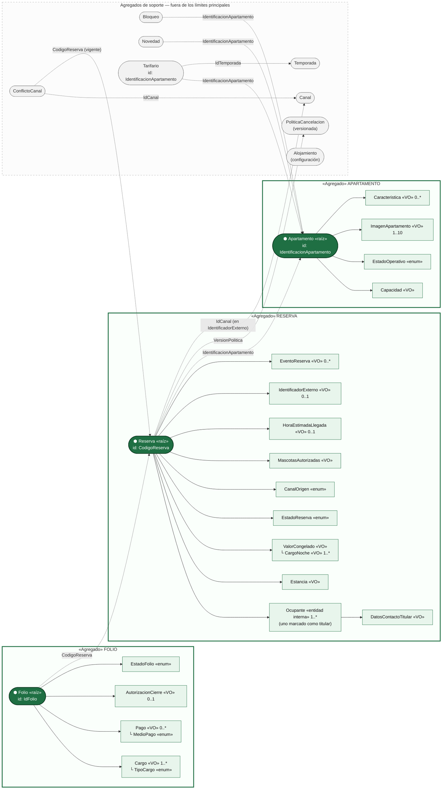

# Mapa de agregados — Vista de límites

Muestra **qué agregados existen, qué queda dentro de cada límite y cómo se referencian entre sí** (siempre por identificador, nunca por objeto). No muestra atributos: eso es el diagrama de clases.

- Caja verde con borde grueso = límite del agregado (todo lo de adentro se guarda y se carga junto con la raíz).
- Óvalo verde oscuro = raíz (única puerta de entrada al agregado).
- Flecha sólida = composición dentro del agregado.
- Flecha punteada = referencia **por identificador** a otro agregado (el texto es el tipo del identificador).

## Invariantes por agregado

### Reserva (raíz: `Reserva`, id `CodigoReserva`)

| # | Invariante | Regla | Dónde se protege |
|---|---|---|---|
| R-1 | Nunca puede transitar a un estado no permitido; FINALIZADA, CANCELADA y NO_SHOW nunca cambian. | RN-08, F-06 | `EstadoReserva.puedeTransicionarA` + `Reserva.verificarTransicion` |
| R-2 | Siempre debe tener al menos una noche y nunca puede nacer con entrada anterior a hoy. | RN-03, RN-04 | Constructor de `Estancia` + `Reserva.crear` |
| R-3 | Nunca puede confirmarse sin hora estimada de llegada. | RN-09 | `Reserva.confirmar` |
| R-4 | Nunca puede pasar a EN_CURSO antes de la fecha de entrada ni si no está CONFIRMADA. | RN-10 | `Reserva.registrarLlegada` |
| R-5 | Su valor y su versión de política nunca cambian, salvo por modificación explícita. | RN-22, RN-14 | Sin setters; solo `Reserva.modificar(...)` reemplaza el `ValorCongelado` |
| R-6 | Siempre debe tener un titular que sea ocupante facturable a la fecha de entrada. | 3.2, RN-06 | `Reserva.crear` / `Reserva.modificar` |

### Apartamento (raíz: `Apartamento`, id `IdentificacionApartamento`)

| # | Invariante | Regla | Dónde se protege |
|---|---|---|---|
| A-1 | El estado operativo solo transita por las transiciones de 7.6. | F-09, 7.6 | `EstadoOperativo.puedeTransicionarA` + métodos de `Apartamento` |
| A-2 | Nunca puede recibir un grupo si no está PREPARADO. | RN-11 | `Apartamento.marcarOcupado` |
| A-3 | Nunca puede pasar a FUERA_DE_SERVICIO estando OCUPADO. | 7.6 | `Apartamento.declararFueraDeServicio` |
| A-4 | Siempre debe tener entre 1 y 10 imágenes y exactamente una principal. | 7.3 | `Apartamento.crear` / `agregarImagen` |
| A-5 | Su capacidad siempre es un entero mayor que cero (tope rígido). | F-03 | Constructor de `Capacidad` |

### Folio (raíz: `Folio`, id `IdFolio`)

| # | Invariante | Regla | Dónde se protege |
|---|---|---|---|
| F-1 | El saldo siempre es Σ cargos − Σ pagos; se calcula, nunca se guarda. | RN-15 | `Folio.saldo()` |
| F-2 | Nunca se modifica ni se elimina un cargo o un pago; toda corrección es un movimiento inverso. | RN-16 | Listas inmodificables; solo `registrarCargo` / `registrarPago` |
| F-3 | Nunca puede cerrarse con saldo distinto de cero sin `AutorizacionCierre`. | RN-17 | `Folio.cerrar` |
| F-4 | Todo pago siempre tiene medio y fecha. | RN-15, F-08 | Constructor de `Pago` |
| F-5 | Un folio cerrado nunca admite nuevos movimientos. | 7.7 | `Folio.verificarAbierto` |

## Qué queda fuera de cada límite y por qué

| Concepto | Decisión | Razón |
|---|---|---|
| Ocupante | **Dentro** de Reserva (entidad interna) | Solo existe en el contexto de una reserva; su identidad es local a ella. Nadie lo modifica sin pasar por la reserva. |
| Folio | **Fuera** de Reserva (agregado propio) | Ciclo de vida distinto: sigue recibiendo pagos y se cierra en la salida. Que el folio esté cerrado para salir lo coordina `SalidaGrupoService`. |
| Novedad | **Fuera** de Apartamento | Crece sin límite y ninguna invariante del apartamento depende de ella. Cambiar el estado operativo no debería cargar todo el historial. |
| Bloqueo | **Fuera** de Apartamento | 3.3: un bloqueo no cambia el estado operativo ni al revés. Su regla ("no bloquear noches con reservas activas") cruza con Reserva → `RegistroBloqueoService`. |
| Tarifario | **Fuera** de Apartamento (su id es la IdentificacionApartamento: uno por apartamento) | Las tarifas cambian por temporada sin tocar el apartamento, y las reservas guardan su valor congelado. "Tarifas completas para activar" → `VerificadorTarifasCompletasService`. |
| Política de cancelación | **Fuera** de Reserva | Única del alojamiento y versionada; la reserva solo guarda `VersionPolitica`. |
| Temporada, Canal, ConflictoCanal, Alojamiento | Agregados de soporte | Se administran por separado; los agregados principales solo guardan sus identificadores. |
