# Mapa de agregados — Vista de servicios

Una vista por servicio de dominio. Cada vista muestra **qué agregados coordina** (flecha sólida) y **de qué repositorios o puertos depende** (flecha punteada). Coincide exactamente con la hoja *Catálogo de Servicios*.

- Hexágono azul = servicio de dominio · Óvalo verde = agregado · Cilindro amarillo = repositorio · Paralelogramo morado = puerto del dominio.
- Los servicios sin repositorios reciben los agregados ya cargados por el caso de uso: solo coordinan, no consultan conjuntos.

## Resumen: servicio × agregado

| Servicio | Reserva | Apartamento | Folio | Bloqueo | Temporada | Tarifario | PoliticaCancelacion | ConflictoCanal |
|---|---|---|---|---|---|---|---|---|
| DisponibilidadApartamentoService | ● | ● |  | ● |  |  |  |  |
| CotizadorEstanciaService |  |  |  |  | ● | ● |  |  |
| ConfirmacionReservaService | ● |  | ● |  |  |  |  |  |
| EntregaApartamentoService | ● | ● |  |  |  |  |  |  |
| SalidaGrupoService | ● | ● | ● |  |  |  |  |  |
| CalculadorRetencionService | ● |  |  |  |  |  | ● |  |
| ConciliacionCanalExternoService | ● | ● |  |  |  |  |  | ● |
| RegistroBloqueoService | ● |  |  | ● |  |  |  |  |
| CalendarioTemporadasService |  |  |  |  | ● |  |  |  |
| VerificadorTarifasCompletasService |  | ● |  |  | ● | ● |  |  |
| RetiroApartamentoService | ● | ● |  |  |  |  |  |  |
| VerificadorEstanciaMinimaService |  |  |  |  | ● |  |  |  |
| AdmisionMascotasService |  | ● |  |  |  |  |  |  |

## A. Ciclo de vida de la reserva

### DisponibilidadApartamentoService

- **Reglas que resuelve:** RN-01, RN-02, RN-07, RN-12, RN-20, 3.3
- **Firma:** `void verificarDisponible(Apartamento apartamento, Estancia estancia, int totalOcupantes, CodigoReserva reservaExcluida)` · `boolean estaDisponible(Apartamento apartamento, Estancia estancia, int totalOcupantes)`
- **Por qué no vive en un solo agregado:** Exige comparar contra TODAS las reservas activas y los bloqueos del apartamento, y leer capacidad y estado de activo del Apartamento (otro agregado). Ninguna reserva conoce a las demás. El tiempo de preparación y el horario se piden a ConfiguracionAlojamiento. reservaExcluida permite revalidar una modificación sin chocar consigo misma (null al crear).
- **Caso de uso que lo invoca:** CU-02, CU-08 (vía conciliación), CU-13, CU-20

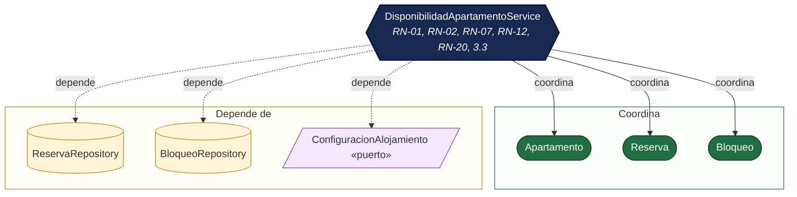

### CotizadorEstanciaService

- **Reglas que resuelve:** RN-05, RN-06, 3.4, RP-02 (cargo por mascota)
- **Firma:** `ValorCongelado cotizar(IdentificacionApartamento apartamento, Estancia estancia, ComposicionGrupo grupo)`
- **Por qué no vive en un solo agregado:** El cálculo noche por noche necesita el calendario de temporadas (agregado Temporada) y las tarifas del apartamento (agregado Tarifario); la Reserva solo recibe el valor ya congelado. El umbral de edad se pide a ConfiguracionAlojamiento. El redondeo se aplica al final de cada cargo.
- **Caso de uso que lo invoca:** CU-01, CU-02, CU-08, CU-13, CU-20

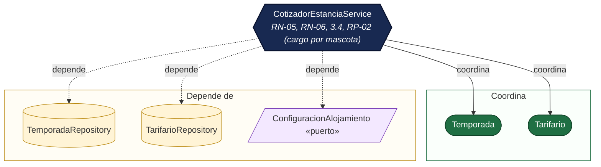

### ConfirmacionReservaService

- **Reglas que resuelve:** L-11 (coordina RN-08 y RN-09 de Reserva)
- **Firma:** `void confirmar(Reserva reserva, Folio folio, String autor, LocalDateTime ahora)`
- **Por qué no vive en un solo agregado:** El anticipo pagado está en el Folio (otro agregado) y la Reserva no puede ver sus pagos; el porcentaje exigido es configuración. El servicio verifica folio.totalPagos() ≥ anticipo.exigidoSobre(reserva.valor().total()) y luego llama reserva.confirmar(), que protege RN-08 y RN-09.
- **Caso de uso que lo invoca:** CU-03

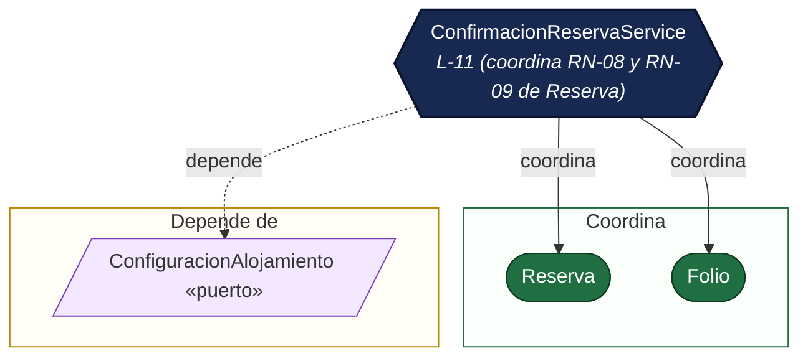

### EntregaApartamentoService

- **Reglas que resuelve:** RN-11 (coordina RN-10 de Reserva)
- **Firma:** `void registrarLlegada(Reserva reserva, Apartamento apartamento, String autor, LocalDateTime ahora)`
- **Por qué no vive en un solo agregado:** Registrar la llegada cambia dos agregados a la vez: la Reserva no puede leer el estado operativo del Apartamento ni el Apartamento conoce la reserva. El servicio verifica que la reserva sea de ese apartamento, que reserva.puedeRegistrarLlegada(hoy) (RN-10) y apartamento.puedeRecibirGrupo() (RN-11) ANTES de cambiar cualquiera; solo entonces llama reserva.registrarLlegada() y apartamento.marcarOcupado(). Así nunca queda uno cambiado y el otro no.
- **Caso de uso que lo invoca:** CU-05

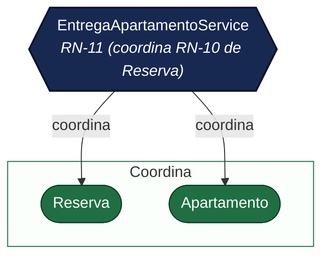

### SalidaGrupoService

- **Reglas que resuelve:** 7.6 (coordina RN-17 de Folio)
- **Firma:** `void registrarSalida(Reserva reserva, Folio folio, Apartamento apartamento, String autor, LocalDateTime ahora)`
- **Por qué no vive en un solo agregado:** El folio cerrado es requisito de la salida, pero Folio es otro agregado (y cerrarlo con saldo exige autorización, RN-17, que vive en Folio). El servicio verifica folio.estaCerrado() y que los tres correspondan entre sí; luego coordina reserva.registrarSalida() y apartamento.liberar() sin fusionar fronteras.
- **Caso de uso que lo invoca:** CU-06

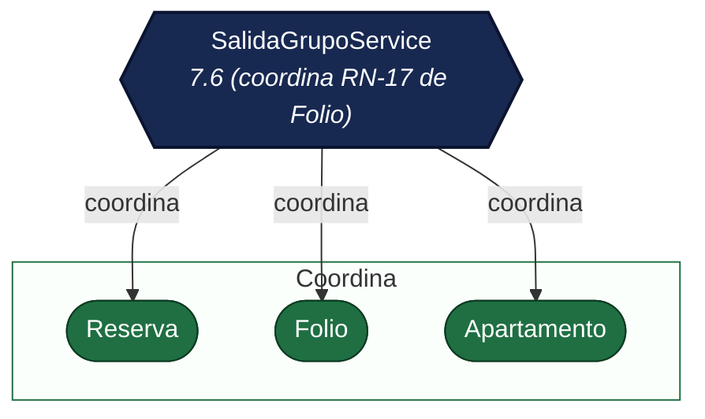

### CalculadorRetencionService

- **Reglas que resuelve:** RN-13, 7.5
- **Firma:** `Dinero calcularRetencion(Reserva reserva, LocalDateTime momentoCancelacion)` · `Dinero calcularPenalidadNoShow(Reserva reserva)`
- **Por qué no vive en un solo agregado:** La reserva solo guarda su VersionPolitica; los tramos viven en el agregado PoliticaCancelacion (versión histórica). El servicio cruza la antelación de la cancelación con la versión congelada. El caso de uso entrega la retención a Folio.liquidarCancelacion.
- **Caso de uso que lo invoca:** CU-04, CU-12

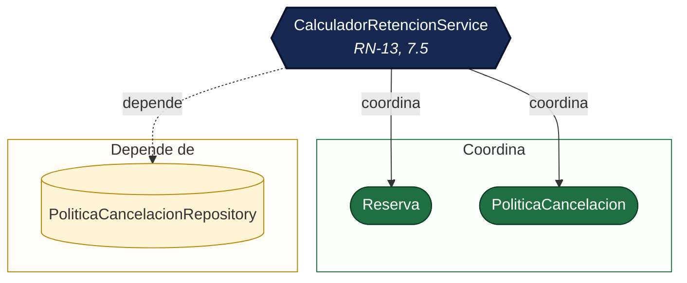

## B. Canal externo y administración

### ConciliacionCanalExternoService

- **Reglas que resuelve:** RN-18, RN-19
- **Firma:** `ResultadoConciliacion conciliar(IdentificadorExterno identificador, Apartamento apartamento, Estancia estancia, int totalOcupantes, LocalDateTime ahora)`
- **Por qué no vive en un solo agregado:** Detectar un mensaje repetido exige buscar en el conjunto de reservas por canal + identificador externo, y detectar un conflicto exige la disponibilidad de todo el apartamento; ninguna reserva individual puede garantizarlo. Devuelve ACEPTAR, YA_EXISTE (con la reserva existente) o CONFLICTO (con el ConflictoCanal nuevo); nunca toca la reserva vigente.
- **Caso de uso que lo invoca:** CU-08

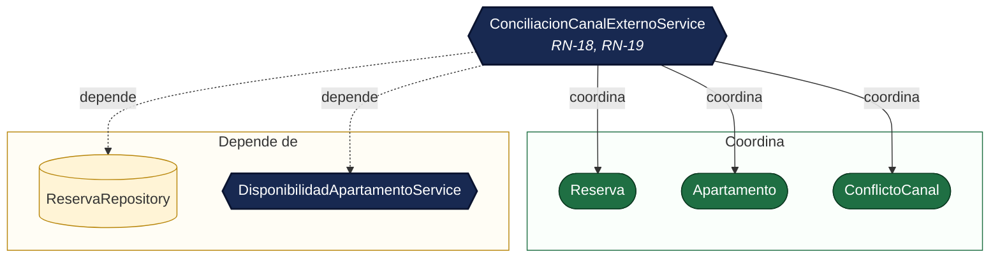

### RegistroBloqueoService

- **Reglas que resuelve:** 7.3, RN-07
- **Firma:** `Bloqueo registrar(IdentificacionApartamento apartamento, RangoFechas rango, String motivo, String autor, LocalDateTime ahora)`
- **Por qué no vive en un solo agregado:** No puede registrarse un bloqueo sobre noches con reservas activas: requiere consultar las reservas del apartamento, que son otro agregado.
- **Caso de uso que lo invoca:** CU-16

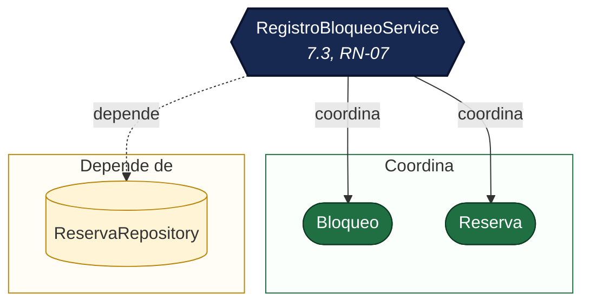

### CalendarioTemporadasService

- **Reglas que resuelve:** 7.4, F-05
- **Firma:** `void verificarCalendario(Temporada nueva)`
- **Por qué no vive en un solo agregado:** Que las temporadas no se solapen y que exista exactamente una base depende de todas las temporadas, no de una sola.
- **Caso de uso que lo invoca:** Gestionar temporadas (POST/PUT /api/temporadas)

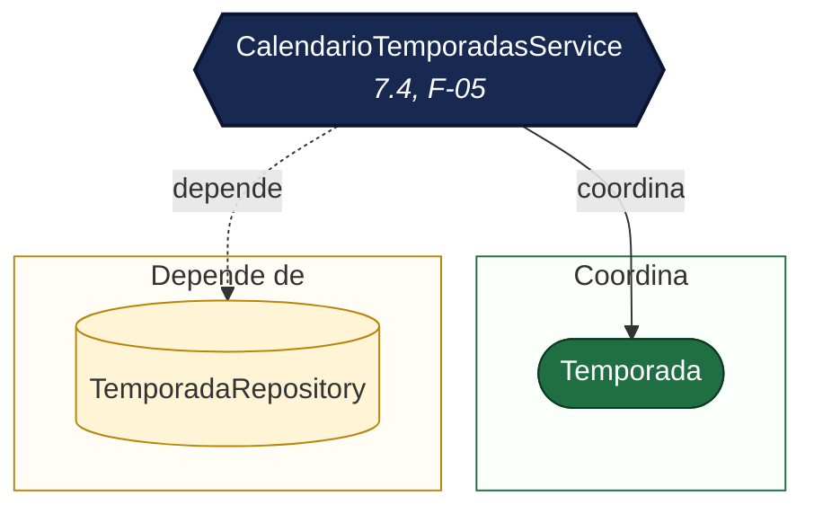

### VerificadorTarifasCompletasService

- **Reglas que resuelve:** 7.4
- **Firma:** `void verificarTarifasCompletas(IdentificacionApartamento apartamento)`
- **Por qué no vive en un solo agregado:** Activar un apartamento o reservarlo exige tarifa en TODAS las temporadas: cruza el agregado Temporada con el Tarifario del apartamento.
- **Caso de uso que lo invoca:** CU-02, CU-08, CU-13, Activar apartamento

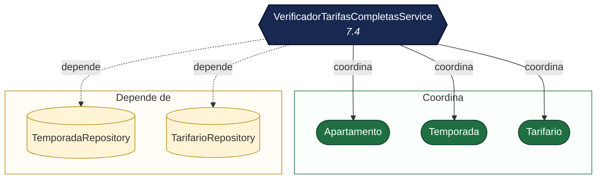

### RetiroApartamentoService

- **Reglas que resuelve:** 7.3
- **Firma:** `void retirarDeLaVenta(Apartamento apartamento, LocalDate hoy)`
- **Por qué no vive en un solo agregado:** Solo se retira si no tiene reservas activas ni futuras: requiere consultar reservas, que son otro agregado.
- **Caso de uso que lo invoca:** Retirar apartamento (DELETE /api/apartamentos/{identificacion})

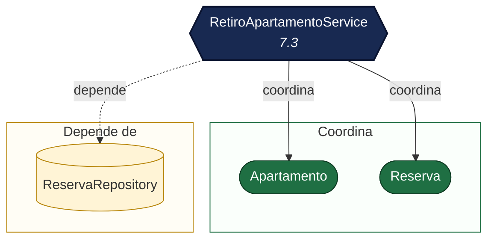

## C. Reglas propias del grupo

### VerificadorEstanciaMinimaService

- **Reglas que resuelve:** RP-01
- **Firma:** `void verificarEstanciaMinima(Estancia estancia)`
- **Por qué no vive en un solo agregado:** La estancia mínima depende de la temporada de la noche de entrada (otro agregado): no cabe en Estancia ni en Reserva.
- **Caso de uso que lo invoca:** CU-02, CU-08, CU-13

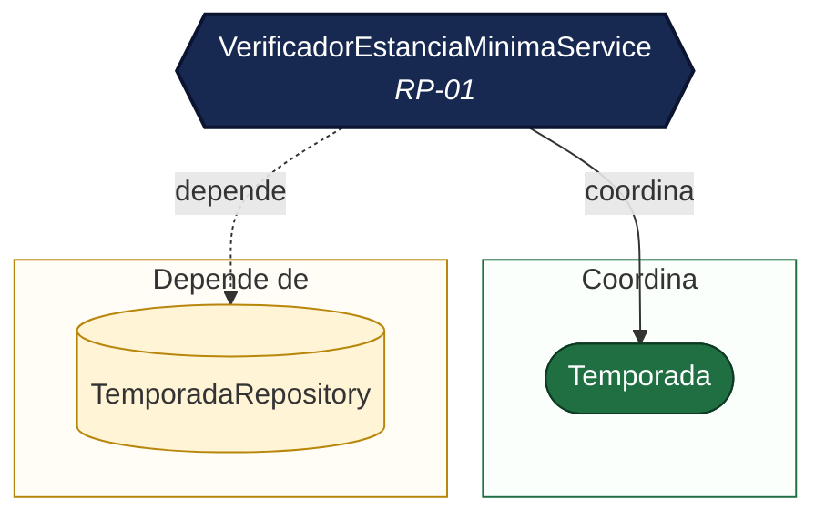

### AdmisionMascotasService

- **Reglas que resuelve:** RP-02
- **Firma:** `void verificarMascotas(Apartamento apartamento, MascotasAutorizadas mascotas)` · `Dinero cargoPorMascotas(MascotasAutorizadas mascotas, Estancia estancia)`
- **Por qué no vive en un solo agregado:** Depende de una característica del Apartamento (otro agregado) y del cupo configurable del alojamiento; la Reserva no conoce ninguno de los dos.
- **Caso de uso que lo invoca:** CU-02, CU-13

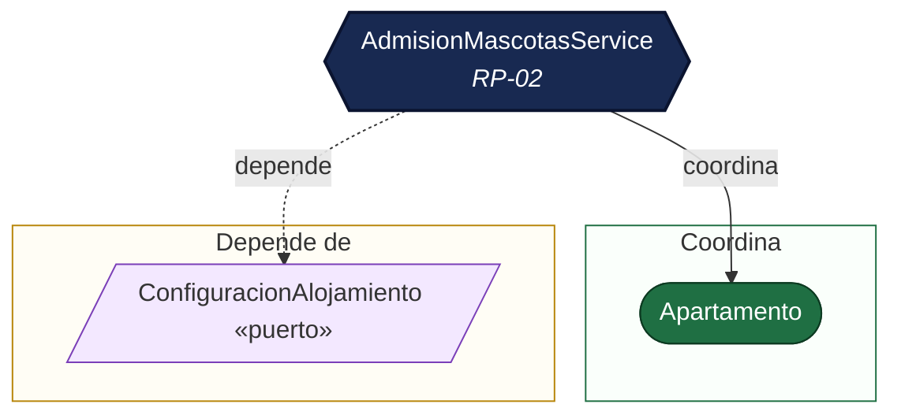

### RecargoLlegadaNocturna — objeto de valor, no servicio

- **Reglas que resuelve:** RP-03
- **Firma:** `boolean aplicaA(HoraEstimadaLlegada hora)` · `Optional<Cargo> cargoPorCambioDeHora(HoraEstimadaLlegada anterior, HoraEstimadaLlegada nueva, LocalDateTime ahora)`
- **Por qué no vive en un solo agregado:** La regla es sobre valores (hora ≥ hora de inicio): cabe en un objeto de valor y no necesita servicio. Devuelve el recargo, su movimiento inverso o nada, y el caso de uso solo lo entrega a Folio.registrarCargo.
- **Caso de uso que lo invoca:** CU-02, CU-14

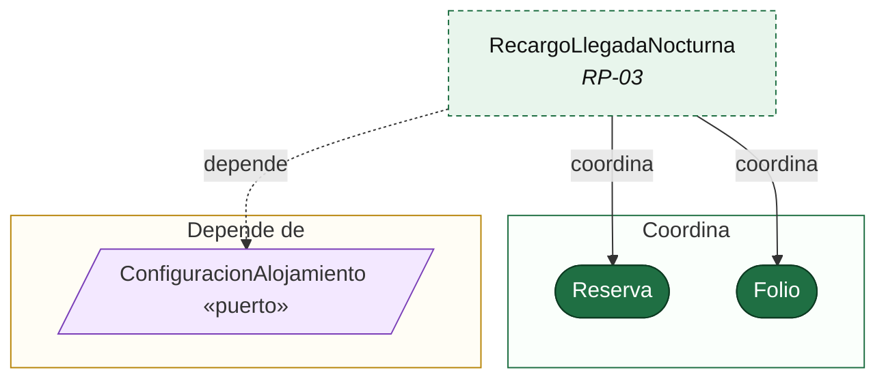
