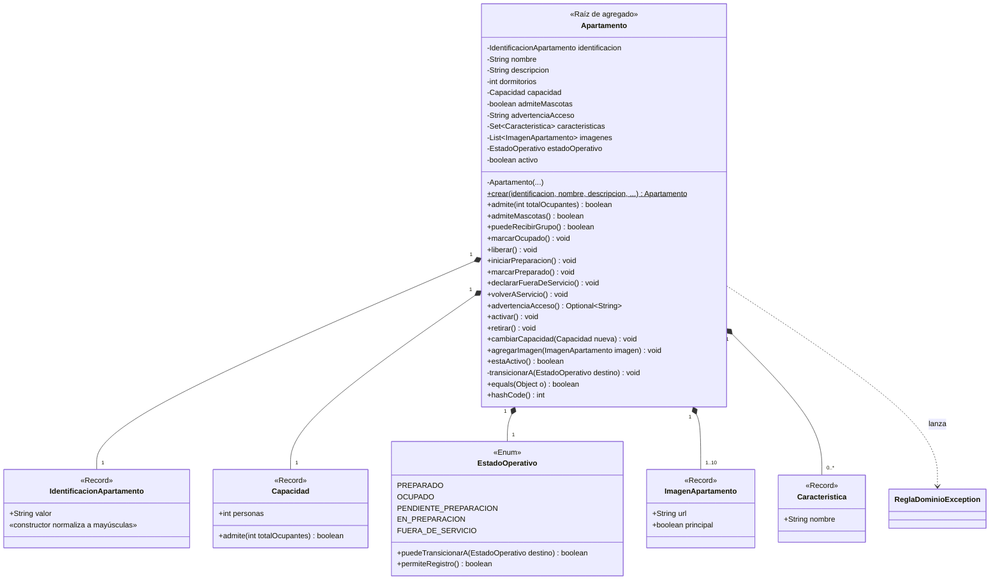
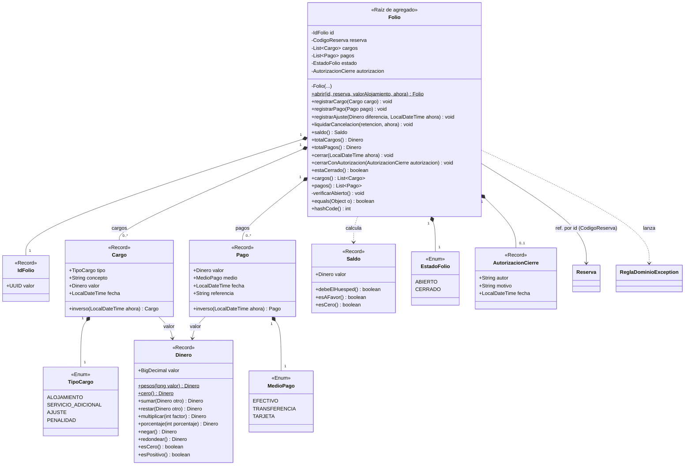
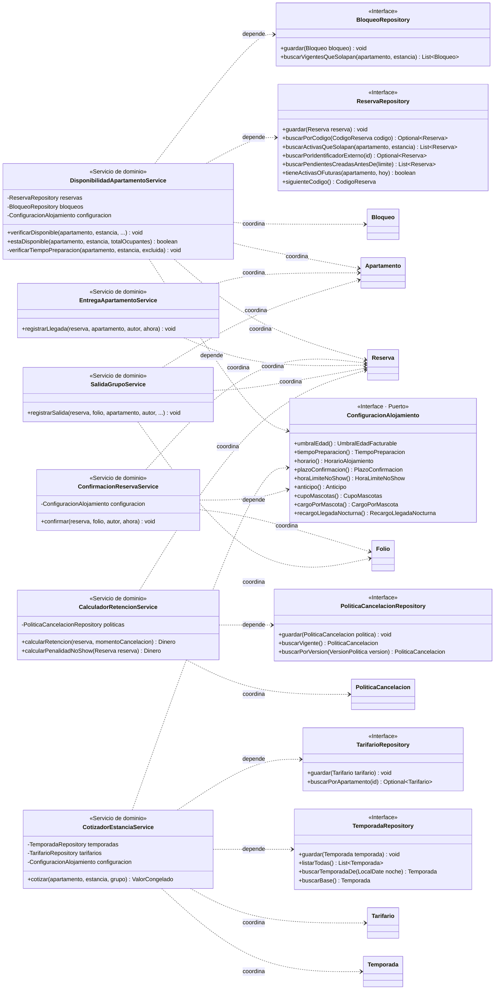
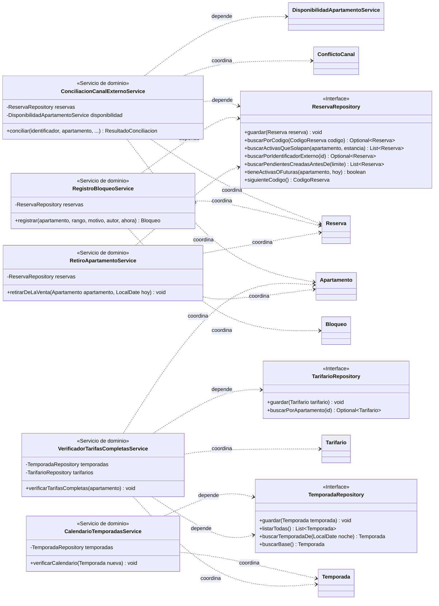
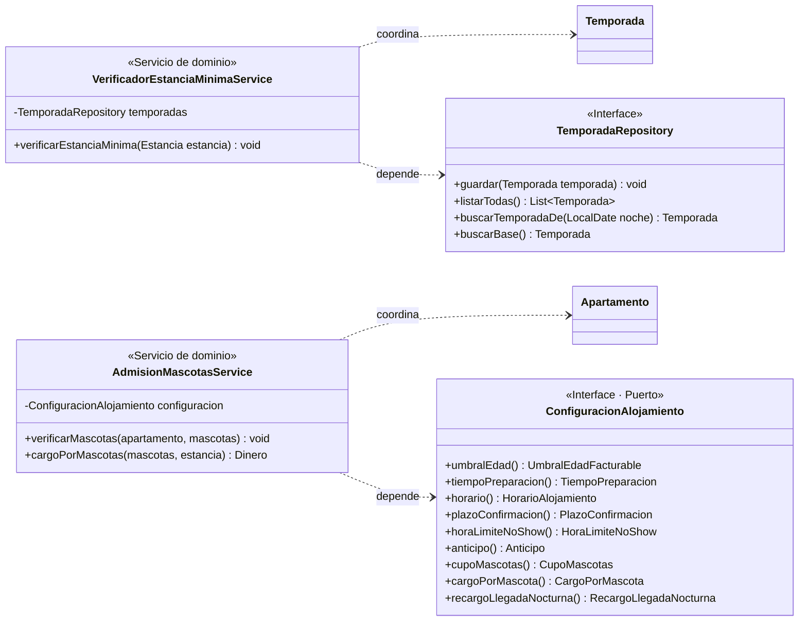

# Diagrama de clases — paquete `domain`

Corresponde 1 a 1 con el código del paquete `domain`. No hay clases de Spring ni de infraestructura: los repositorios y `ConfiguracionAlojamiento` son **interfaces del dominio**; sus implementaciones en memoria viven en `infrastructure`.

## Cómo leerlo

| Relación | Notación | Significado |
|---|---|---|
| Composición dentro del agregado | rombo negro `*--` | La parte vive y muere con la raíz; se guarda y se carga con ella. |
| Referencia por identificador entre agregados | flecha sólida `-->` con etiqueta *ref. por id (Tipo)* | El atributo es el **identificador** (p. ej. `IdentificacionApartamento`), nunca el objeto del otro agregado. |
| Dependencia desde los servicios | flecha punteada `..>` con *coordina*, *depende* o *persiste* | El servicio recibe o consulta ese tipo; no lo contiene. |
| Herencia | `--\|>` | Solo `ReglaDominioException extends RuntimeException`. |

Estereotipos: **«Raíz de agregado»** y **«Entidad»** tienen constructor privado (`-Clase(...)`), fábrica estática subrayada, ningún setter y `equals/hashCode` por identidad. **«Record»** son objetos de valor que validan en su constructor compacto y lanzan `ReglaDominioException`. **«Enum»** son objetos de valor con valores fijos. Las firmas largas se muestran con nombres de parámetros; la firma completa de cada servicio está en la hoja *Catálogo de Servicios*.

Todas las clases del dominio lanzan la misma excepción: `ReglaDominioException(codigo, mensaje)`, cuyo `codigo` es el de la hoja *Errores de Negocio*.

## Vistas por parte

Cada vista muestra completas solo sus clases; las clases de otras vistas aparecen como cajas vacías para indicar la relación.

### 1. Agregado Reserva

```mermaid
classDiagram
  direction TB
  class Reserva {
    <<Raíz de agregado>>
    -CodigoReserva codigo
    -IdentificacionApartamento apartamento
    -Estancia estancia
    -List~Ocupante~ ocupantes
    -EstadoReserva estado
    -CanalOrigen canal
    -IdentificadorExterno identificadorExterno
    -HoraEstimadaLlegada horaEstimadaLlegada
    -MascotasAutorizadas mascotas
    -ValorCongelado valor
    -VersionPolitica versionPolitica
    -LocalDateTime fechaCreacion
    -List~EventoReserva~ eventos
    -Reserva(...)
    +crear(codigo, apartamento, estancia, ocupantes, ...)$ Reserva
    +indicarHoraEstimadaLlegada(hora, autor, ahora) void
    +confirmar(String autor, LocalDateTime ahora) void
    +puedeRegistrarLlegada(LocalDate hoy) boolean
    +registrarLlegada(String autor, LocalDateTime ahora) void
    +registrarSalida(String autor, LocalDateTime ahora) void
    +cancelar(String autor, LocalDateTime ahora) void
    +declararNoShow(limite, autor, ahora) void
    +vencer(PlazoConfirmacion plazo, LocalDateTime ahora) void
    +modificar(apartamento, estancia, ocupantes, ...) Dinero
    +estaActiva() boolean
    +titular() Ocupante
    +composicion() ComposicionGrupo
    +totalOcupantes() int
    -verificarTransicion(EstadoReserva destino) void
    -verificarModificable() void
    -verificarEntradaNoPasada(estancia, hoy)$ void
    -verificarTitular(ocupantes, estancia, umbral)$ void
    +equals(Object o) boolean
    +hashCode() int
  }
  class Ocupante {
    <<Entidad>>
    -IdOcupante id
    -String nombre
    -LocalDate fechaNacimiento
    -DocumentoIdentidad documento
    -boolean titular
    -DatosContactoTitular contacto
    -Ocupante(...)
    +acompanante(id, nombre, nacimiento, documento)$ Ocupante
    +titular(id, nombre, nacimiento, documento, ...)$ Ocupante
    +esFacturableEn(entrada, umbral) boolean
    +esTitular() boolean
    +equals(Object o) boolean
    +hashCode() int
  }
  class Estancia {
    <<Record>>
    +LocalDate entrada
    +LocalDate salida
    +noches() int
    +seSolapaCon(Estancia otra) boolean
    +contiene(LocalDate noche) boolean
    +fechasDeNoches() List~LocalDate~
  }
  class ValorCongelado {
    <<Record>>
    +List~CargoNoche~ noches
    +total() Dinero
    +diferenciaCon(ValorCongelado anterior) Dinero
  }
  class CargoNoche {
    <<Record>>
    +LocalDate fecha
    +String temporada
    +Dinero tarifa
    +int ocupantesFacturables
    +subtotal() Dinero
  }
  class EstadoReserva {
    <<Enum>>
    PENDIENTE
    CONFIRMADA
    EN_CURSO
    FINALIZADA
    CANCELADA
    NO_SHOW
    +puedeTransicionarA(EstadoReserva destino) boolean
    +retieneDisponibilidad() boolean
    +esTerminal() boolean
  }
  class CanalOrigen {
    <<Enum>>
    PORTAL
    DIRECTO
    EXTERNO
  }
  class IdentificadorExterno {
    <<Record>>
    +IdCanal canal
    +String codigo
  }
  class HoraEstimadaLlegada {
    <<Record>>
    +LocalTime hora
    +esIgualOPosteriorA(LocalTime referencia) boolean
  }
  class MascotasAutorizadas {
    <<Record>>
    +int cantidad
    +ninguna()$ MascotasAutorizadas
    +hayMascotas() boolean
  }
  class EventoReserva {
    <<Record>>
    +String descripcion
    +String autor
    +LocalDateTime fecha
  }
  class DatosContactoTitular {
    <<Record>>
    +String correo
    +String telefono
  }
  class CodigoReserva {
    <<Record>>
    +String valor
  }
  class IdOcupante {
    <<Record>>
    +UUID valor
  }
  class DocumentoIdentidad {
    <<Record>>
    +String numero
  }
  class VersionPolitica {
    <<Record>>
    +int numero
  }
  class ComposicionGrupo {
    <<Record>>
    +List~LocalDate~ fechasNacimiento
    +total() int
    +facturablesEn(entrada, umbral) int
  }
  Reserva "1" *-- "1" CodigoReserva
  Reserva "1" *-- "1..*" Ocupante : ocupantes
  Reserva "1" *-- "1" Estancia
  Reserva "1" *-- "1" ValorCongelado
  ValorCongelado "1" *-- "1..*" CargoNoche
  Reserva "1" *-- "1" EstadoReserva
  Reserva "1" *-- "1" CanalOrigen
  Reserva "1" *-- "0..1" IdentificadorExterno
  Reserva "1" *-- "0..1" HoraEstimadaLlegada
  Reserva "1" *-- "1" MascotasAutorizadas
  Reserva "1" *-- "0..*" EventoReserva
  Reserva "1" *-- "1" VersionPolitica
  Ocupante "1" *-- "1" IdOcupante
  Ocupante "1" *-- "0..1" DocumentoIdentidad
  Ocupante "1" *-- "0..1" DatosContactoTitular
  Reserva ..> ComposicionGrupo : produce
  Reserva --> Apartamento : ref. por id (IdentificacionApartamento)
  Reserva --> PoliticaCancelacion : ref. por id (VersionPolitica)
  IdentificadorExterno --> Canal : ref. por id (IdCanal)
  Reserva ..> ReglaDominioException : lanza
```



### 2. Agregado Apartamento



### 3. Agregado Folio (y Dinero, transversal)



### 4. Agregados de soporte y configuración

```mermaid
classDiagram
  direction TB
  class Bloqueo {
    <<Entidad>>
    -IdBloqueo id
    -IdentificacionApartamento apartamento
    -RangoFechas rango
    -String motivo
    -String autor
    -LocalDateTime fechaRegistro
    -boolean levantado
    -Bloqueo(...)
    +registrar(id, apartamento, rango, motivo, ...)$ Bloqueo
    +afecta(Estancia estancia) boolean
    +levantar() void
    +equals(Object o) boolean
    +hashCode() int
  }
  class IdBloqueo {
    <<Record>>
    +UUID valor
  }
  class RangoFechas {
    <<Record>>
    +LocalDate inicio
    +LocalDate fin
    +seSolapaCon(Estancia estancia) boolean
    +seSolapaCon(RangoFechas otro) boolean
    +contiene(LocalDate fecha) boolean
  }
  class Temporada {
    <<Entidad>>
    -IdTemporada id
    -String nombre
    -List~RangoFechas~ periodos
    -boolean esBase
    -EstanciaMinima estanciaMinima
    -Temporada(...)
    +crear(id, nombre, periodos, estanciaMinima)$ Temporada
    +agregarPeriodo(RangoFechas periodo) void
    +crearBase(id, nombre)$ Temporada
    +contiene(LocalDate noche) boolean
    +seSolapaCon(Temporada otra) boolean
    +cambiarEstanciaMinima(EstanciaMinima nueva) void
    +equals(Object o) boolean
    +hashCode() int
  }
  class IdTemporada {
    <<Record>>
    +UUID valor
  }
  class EstanciaMinima {
    <<Record>>
    +int noches
    +seCumpleCon(Estancia estancia) boolean
  }
  class Tarifario {
    <<Entidad>>
    -IdentificacionApartamento apartamento
    -List~Tarifa~ tarifas
    -Tarifario(...)
    +nuevo(IdentificacionApartamento apartamento)$ Tarifario
    +definirTarifa(temporada, valor, desde) void
    +tarifaVigente(IdTemporada temporada) Optional~Tarifa~
    +tieneTarifaPara(IdTemporada temporada) boolean
    +historico() List~Tarifa~
    +equals(Object o) boolean
    +hashCode() int
  }
  class Tarifa {
    <<Record>>
    +IdTemporada temporada
    +Dinero valor
    +LocalDateTime vigenteDesde
  }
  class PoliticaCancelacion {
    <<Entidad>>
    -VersionPolitica version
    -List~TramoPolitica~ tramos
    -int porcentajeRetencionNoShow
    -LocalDateTime vigenteDesde
    -PoliticaCancelacion(...)
    +crearVersion(version, tramos, ...)$ PoliticaCancelacion
    +nuevaVersion(tramos, porcentajeNoShow, ...) PoliticaCancelacion
    +retencionPara(Dinero valor, long diasAntelacion) Dinero
    +retencionNoShow(Dinero valor) Dinero
    +equals(Object o) boolean
    +hashCode() int
  }
  class TramoPolitica {
    <<Record>>
    +int antelacionMinimaDias
    +int porcentajeRetencion
  }
  class Novedad {
    <<Entidad>>
    -IdNovedad id
    -IdentificacionApartamento apartamento
    -LocalDateTime fecha
    -String autor
    -String descripcion
    -GravedadNovedad gravedad
    -Novedad(...)
    +registrar(id, apartamento, autor, descripcion, ...)$ Novedad
    +equals(Object o) boolean
    +hashCode() int
  }
  class IdNovedad {
    <<Record>>
    +UUID valor
  }
  class GravedadNovedad {
    <<Enum>>
    BAJA
    MEDIA
    ALTA
    CRITICA
  }
  class Canal {
    <<Entidad>>
    -IdCanal id
    -String nombre
    -CanalOrigen tipo
    -List~EventoCanal~ eventos
    -Canal(...)
    +registrar(id, nombre, tipo)$ Canal
    +registrarEvento(EventoCanal evento) void
    +equals(Object o) boolean
    +hashCode() int
  }
  class IdCanal {
    <<Record>>
    +UUID valor
  }
  class EventoCanal {
    <<Record>>
    +String tipo
    +String identificadorExterno
    +LocalDateTime fecha
    +String resultado
  }
  class ConflictoCanal {
    <<Entidad>>
    -IdConflictoCanal id
    -IdentificadorExterno identificadorExterno
    -IdentificacionApartamento apartamento
    -Estancia estancia
    -CodigoReserva reservaVigente
    -EstadoConflicto estado
    -String resolucion
    -String autorResolucion
    -LocalDateTime fechaResolucion
    -LocalDateTime fechaRegistro
    -ConflictoCanal(...)
    +registrar(id, identificadorExterno, ...)$ ConflictoCanal
    +resolver(autor, resolucion, ahora) void
    +equals(Object o) boolean
    +hashCode() int
  }
  class IdConflictoCanal {
    <<Record>>
    +UUID valor
  }
  class EstadoConflicto {
    <<Enum>>
    PENDIENTE
    RESUELTO
  }
  class ResultadoConciliacion {
    <<Record>>
    +TipoConciliacion tipo
    +CodigoReserva reservaExistente
    +ConflictoCanal conflicto
    +aceptar()$ ResultadoConciliacion
    +yaExiste(CodigoReserva codigo)$ ResultadoConciliacion
    +conflicto(ConflictoCanal conflicto)$ ResultadoConciliacion
  }
  class TipoConciliacion {
    <<Enum>>
    ACEPTAR
    YA_EXISTE
    CONFLICTO
  }
  class Alojamiento {
    <<Entidad>>
    -UUID id
    -String nombre
    -String descripcion
    -String ciudad
    -String direccion
    -Ubicacion ubicacion
    -HorarioAlojamiento horario
    -List~String~ normasConvivencia
    -UmbralEdadFacturable umbralEdad
    -TiempoPreparacion tiempoPreparacion
    -PlazoConfirmacion plazoConfirmacion
    -HoraLimiteNoShow horaLimiteNoShow
    -Anticipo anticipo
    -List~ServicioAdicional~ servicios
    -Set~MedioPago~ mediosPago
    -CupoMascotas cupoMascotas
    -CargoPorMascota cargoPorMascota
    -RecargoLlegadaNocturna recargoLlegadaNocturna
    -Alojamiento(...)
    +crear(id, nombre, descripcion, ...)$ Alojamiento
    +actualizarParametros(...) void
    +aceptaMedioPago(MedioPago medio) boolean
    +equals(Object o) boolean
    +hashCode() int
  }
  class UmbralEdadFacturable {
    <<Record>>
    +int anios
    +alcanzadoPor(LocalDate nacimiento, LocalDate fecha) boolean
  }
  class TiempoPreparacion {
    <<Record>>
    +int horas
    +cabeEn(HorarioAlojamiento horario) boolean
  }
  class PlazoConfirmacion {
    <<Record>>
    +int horas
    +vencido(LocalDateTime creacion, LocalDateTime ahora) boolean
  }
  class HoraLimiteNoShow {
    <<Record>>
    +LocalTime hora
    +alcanzada(LocalDate entrada, LocalDateTime ahora) boolean
  }
  class HorarioAlojamiento {
    <<Record>>
    +LocalTime horaEntrada
    +LocalTime horaSalida
    +ventanaPreparacionHoras() long
  }
  class Anticipo {
    <<Record>>
    +boolean exigido
    +int porcentaje
    +exigidoSobre(Dinero valor) Dinero
  }
  class ServicioAdicional {
    <<Record>>
    +String nombre
    +boolean generaCargo
    +Dinero valor
  }
  class Ubicacion {
    <<Record>>
    +double latitud
    +double longitud
  }
  class RecargoLlegadaNocturna {
    <<Record>>
    +LocalTime horaInicio
    +Dinero valor
    +aplicaA(HoraEstimadaLlegada hora) boolean
    +cargoPorCambioDeHora(anterior, nueva, ahora) Optional~Cargo~
  }
  class CupoMascotas {
    <<Record>>
    +int maximo
    +permite(MascotasAutorizadas mascotas) boolean
  }
  class CargoPorMascota {
    <<Record>>
    +Dinero valorPorNoche
    +calcular(mascotas, estancia) Dinero
  }
  Bloqueo "1" *-- "1" IdBloqueo
  Bloqueo "1" *-- "1" RangoFechas
  Bloqueo --> Apartamento : ref. por id (IdentificacionApartamento)
  Temporada "1" *-- "1" IdTemporada
  Temporada "1" *-- "0..*" RangoFechas : periodos
  Temporada "1" *-- "1" EstanciaMinima
  Tarifario "1" *-- "0..*" Tarifa : tarifas e histórico
  Tarifario --> Apartamento : ref. por id (IdentificacionApartamento)
  Tarifa --> Temporada : ref. por id (IdTemporada)
  PoliticaCancelacion "1" *-- "2..*" TramoPolitica
  Novedad "1" *-- "1" IdNovedad
  Novedad "1" *-- "1" GravedadNovedad
  Novedad --> Apartamento : ref. por id (IdentificacionApartamento)
  Canal "1" *-- "1" IdCanal
  Canal "1" *-- "0..*" EventoCanal : bitácora
  ConflictoCanal "1" *-- "1" IdConflictoCanal
  ConflictoCanal "1" *-- "1" EstadoConflicto
  ConflictoCanal --> Reserva : ref. por id (CodigoReserva)
  ConflictoCanal --> Canal : ref. por id (IdCanal)
  ResultadoConciliacion "1" *-- "1" TipoConciliacion
  ResultadoConciliacion --> ConflictoCanal : 0..1
  Alojamiento "1" *-- "1" UmbralEdadFacturable
  Alojamiento "1" *-- "1" TiempoPreparacion
  Alojamiento "1" *-- "1" PlazoConfirmacion
  Alojamiento "1" *-- "1" HoraLimiteNoShow
  Alojamiento "1" *-- "1" HorarioAlojamiento
  Alojamiento "1" *-- "1" Anticipo
  Alojamiento "1" *-- "0..*" ServicioAdicional
  Alojamiento "1" *-- "1" Ubicacion
  Alojamiento "1" *-- "1" RecargoLlegadaNocturna
  Alojamiento "1" *-- "1" CupoMascotas
  Alojamiento "1" *-- "1" CargoPorMascota
```



### 5. Servicios de dominio — ciclo de vida de la reserva



### 6. Servicios de dominio — canal externo y administración



### 7. Servicios de dominio — reglas propias



### 8. Repositorios, puerto de configuración y excepción

```mermaid
classDiagram
  direction TB
  class ReservaRepository {
    <<Interface>>
    +guardar(Reserva reserva) void
    +buscarPorCodigo(CodigoReserva codigo) Optional~Reserva~
    +buscarActivasQueSolapan(apartamento, estancia) List~Reserva~
    +buscarPorIdentificadorExterno(id) Optional~Reserva~
    +buscarPendientesCreadasAntesDe(limite) List~Reserva~
    +tieneActivasOFuturas(apartamento, hoy) boolean
    +siguienteCodigo() CodigoReserva
  }
  class ApartamentoRepository {
    <<Interface>>
    +guardar(Apartamento apartamento) void
    +buscarPorIdentificacion(id) Optional~Apartamento~
    +listarActivos() List~Apartamento~
  }
  class FolioRepository {
    <<Interface>>
    +guardar(Folio folio) void
    +buscarPorCodigoReserva(CodigoReserva codigo) Optional~Folio~
  }
  class BloqueoRepository {
    <<Interface>>
    +guardar(Bloqueo bloqueo) void
    +buscarVigentesQueSolapan(apartamento, estancia) List~Bloqueo~
  }
  class TemporadaRepository {
    <<Interface>>
    +guardar(Temporada temporada) void
    +listarTodas() List~Temporada~
    +buscarTemporadaDe(LocalDate noche) Temporada
    +buscarBase() Temporada
  }
  class TarifarioRepository {
    <<Interface>>
    +guardar(Tarifario tarifario) void
    +buscarPorApartamento(id) Optional~Tarifario~
  }
  class PoliticaCancelacionRepository {
    <<Interface>>
    +guardar(PoliticaCancelacion politica) void
    +buscarVigente() PoliticaCancelacion
    +buscarPorVersion(VersionPolitica version) PoliticaCancelacion
  }
  class NovedadRepository {
    <<Interface>>
    +guardar(Novedad novedad) void
    +listarPorApartamento(id) List~Novedad~
  }
  class CanalRepository {
    <<Interface>>
    +guardar(Canal canal) void
    +buscarPorId(IdCanal id) Optional~Canal~
  }
  class ConflictoCanalRepository {
    <<Interface>>
    +guardar(ConflictoCanal conflicto) void
    +listarPendientes() List~ConflictoCanal~
  }
  class ConfiguracionAlojamiento {
    <<Interface · Puerto>>
    +umbralEdad() UmbralEdadFacturable
    +tiempoPreparacion() TiempoPreparacion
    +horario() HorarioAlojamiento
    +plazoConfirmacion() PlazoConfirmacion
    +horaLimiteNoShow() HoraLimiteNoShow
    +anticipo() Anticipo
    +cupoMascotas() CupoMascotas
    +cargoPorMascota() CargoPorMascota
    +recargoLlegadaNocturna() RecargoLlegadaNocturna
  }
  class ReglaDominioException {
    <<Excepción>>
    -String codigo
    +ReglaDominioException(String codigo, String mensaje)
    +getCodigo() String
  }
  class RuntimeException {
    <<Java>>
  }
  ReservaRepository ..> Reserva : persiste
  ApartamentoRepository ..> Apartamento : persiste
  FolioRepository ..> Folio : persiste
  BloqueoRepository ..> Bloqueo : persiste
  TemporadaRepository ..> Temporada : persiste
  TarifarioRepository ..> Tarifario : persiste
  PoliticaCancelacionRepository ..> PoliticaCancelacion : persiste
  NovedadRepository ..> Novedad : persiste
  CanalRepository ..> Canal : persiste
  ConflictoCanalRepository ..> ConflictoCanal : persiste
  ConfiguracionAlojamiento ..> Alojamiento : lee configuración
  ReglaDominioException --|> RuntimeException
```



## Vista completa (todo el paquete `domain` en un solo diagrama)

```mermaid
classDiagram
  direction TB
  class Reserva {
    <<Raíz de agregado>>
    -CodigoReserva codigo
    -IdentificacionApartamento apartamento
    -Estancia estancia
    -List~Ocupante~ ocupantes
    -EstadoReserva estado
    -CanalOrigen canal
    -IdentificadorExterno identificadorExterno
    -HoraEstimadaLlegada horaEstimadaLlegada
    -MascotasAutorizadas mascotas
    -ValorCongelado valor
    -VersionPolitica versionPolitica
    -LocalDateTime fechaCreacion
    -List~EventoReserva~ eventos
    -Reserva(...)
    +crear(codigo, apartamento, estancia, ocupantes, ...)$ Reserva
    +indicarHoraEstimadaLlegada(hora, autor, ahora) void
    +confirmar(String autor, LocalDateTime ahora) void
    +puedeRegistrarLlegada(LocalDate hoy) boolean
    +registrarLlegada(String autor, LocalDateTime ahora) void
    +registrarSalida(String autor, LocalDateTime ahora) void
    +cancelar(String autor, LocalDateTime ahora) void
    +declararNoShow(limite, autor, ahora) void
    +vencer(PlazoConfirmacion plazo, LocalDateTime ahora) void
    +modificar(apartamento, estancia, ocupantes, ...) Dinero
    +estaActiva() boolean
    +titular() Ocupante
    +composicion() ComposicionGrupo
    +totalOcupantes() int
    -verificarTransicion(EstadoReserva destino) void
    -verificarModificable() void
    -verificarEntradaNoPasada(estancia, hoy)$ void
    -verificarTitular(ocupantes, estancia, umbral)$ void
    +equals(Object o) boolean
    +hashCode() int
  }
  class Ocupante {
    <<Entidad>>
    -IdOcupante id
    -String nombre
    -LocalDate fechaNacimiento
    -DocumentoIdentidad documento
    -boolean titular
    -DatosContactoTitular contacto
    -Ocupante(...)
    +acompanante(id, nombre, nacimiento, documento)$ Ocupante
    +titular(id, nombre, nacimiento, documento, ...)$ Ocupante
    +esFacturableEn(entrada, umbral) boolean
    +esTitular() boolean
    +equals(Object o) boolean
    +hashCode() int
  }
  class Estancia {
    <<Record>>
    +LocalDate entrada
    +LocalDate salida
    +noches() int
    +seSolapaCon(Estancia otra) boolean
    +contiene(LocalDate noche) boolean
    +fechasDeNoches() List~LocalDate~
  }
  class ValorCongelado {
    <<Record>>
    +List~CargoNoche~ noches
    +total() Dinero
    +diferenciaCon(ValorCongelado anterior) Dinero
  }
  class CargoNoche {
    <<Record>>
    +LocalDate fecha
    +String temporada
    +Dinero tarifa
    +int ocupantesFacturables
    +subtotal() Dinero
  }
  class EstadoReserva {
    <<Enum>>
    PENDIENTE
    CONFIRMADA
    EN_CURSO
    FINALIZADA
    CANCELADA
    NO_SHOW
    +puedeTransicionarA(EstadoReserva destino) boolean
    +retieneDisponibilidad() boolean
    +esTerminal() boolean
  }
  class CanalOrigen {
    <<Enum>>
    PORTAL
    DIRECTO
    EXTERNO
  }
  class IdentificadorExterno {
    <<Record>>
    +IdCanal canal
    +String codigo
  }
  class HoraEstimadaLlegada {
    <<Record>>
    +LocalTime hora
    +esIgualOPosteriorA(LocalTime referencia) boolean
  }
  class MascotasAutorizadas {
    <<Record>>
    +int cantidad
    +ninguna()$ MascotasAutorizadas
    +hayMascotas() boolean
  }
  class EventoReserva {
    <<Record>>
    +String descripcion
    +String autor
    +LocalDateTime fecha
  }
  class DatosContactoTitular {
    <<Record>>
    +String correo
    +String telefono
  }
  class CodigoReserva {
    <<Record>>
    +String valor
  }
  class IdOcupante {
    <<Record>>
    +UUID valor
  }
  class DocumentoIdentidad {
    <<Record>>
    +String numero
  }
  class VersionPolitica {
    <<Record>>
    +int numero
  }
  class ComposicionGrupo {
    <<Record>>
    +List~LocalDate~ fechasNacimiento
    +total() int
    +facturablesEn(entrada, umbral) int
  }
  class Apartamento {
    <<Raíz de agregado>>
    -IdentificacionApartamento identificacion
    -String nombre
    -String descripcion
    -int dormitorios
    -Capacidad capacidad
    -boolean admiteMascotas
    -String advertenciaAcceso
    -Set~Caracteristica~ caracteristicas
    -List~ImagenApartamento~ imagenes
    -EstadoOperativo estadoOperativo
    -boolean activo
    -Apartamento(...)
    +crear(identificacion, nombre, descripcion, ...)$ Apartamento
    +admite(int totalOcupantes) boolean
    +admiteMascotas() boolean
    +puedeRecibirGrupo() boolean
    +marcarOcupado() void
    +liberar() void
    +iniciarPreparacion() void
    +marcarPreparado() void
    +declararFueraDeServicio() void
    +volverAServicio() void
    +advertenciaAcceso() Optional~String~
    +activar() void
    +retirar() void
    +cambiarCapacidad(Capacidad nueva) void
    +agregarImagen(ImagenApartamento imagen) void
    +estaActivo() boolean
    -transicionarA(EstadoOperativo destino) void
    +equals(Object o) boolean
    +hashCode() int
  }
  class IdentificacionApartamento {
    <<Record>>
    +String valor
    «constructor normaliza a mayúsculas»
  }
  class Capacidad {
    <<Record>>
    +int personas
    +admite(int totalOcupantes) boolean
  }
  class EstadoOperativo {
    <<Enum>>
    PREPARADO
    OCUPADO
    PENDIENTE_PREPARACION
    EN_PREPARACION
    FUERA_DE_SERVICIO
    +puedeTransicionarA(EstadoOperativo destino) boolean
    +permiteRegistro() boolean
  }
  class ImagenApartamento {
    <<Record>>
    +String url
    +boolean principal
  }
  class Caracteristica {
    <<Record>>
    +String nombre
  }
  class Folio {
    <<Raíz de agregado>>
    -IdFolio id
    -CodigoReserva reserva
    -List~Cargo~ cargos
    -List~Pago~ pagos
    -EstadoFolio estado
    -AutorizacionCierre autorizacion
    -Folio(...)
    +abrir(id, reserva, valorAlojamiento, ahora)$ Folio
    +registrarCargo(Cargo cargo) void
    +registrarPago(Pago pago) void
    +registrarAjuste(Dinero diferencia, LocalDateTime ahora) void
    +liquidarCancelacion(retencion, ahora) void
    +saldo() Saldo
    +totalCargos() Dinero
    +totalPagos() Dinero
    +cerrar(LocalDateTime ahora) void
    +cerrarConAutorizacion(AutorizacionCierre autorizacion) void
    +estaCerrado() boolean
    +cargos() List~Cargo~
    +pagos() List~Pago~
    -verificarAbierto() void
    +equals(Object o) boolean
    +hashCode() int
  }
  class IdFolio {
    <<Record>>
    +UUID valor
  }
  class Cargo {
    <<Record>>
    +TipoCargo tipo
    +String concepto
    +Dinero valor
    +LocalDateTime fecha
    +inverso(LocalDateTime ahora) Cargo
  }
  class Pago {
    <<Record>>
    +Dinero valor
    +MedioPago medio
    +LocalDateTime fecha
    +String referencia
    +inverso(LocalDateTime ahora) Pago
  }
  class Saldo {
    <<Record>>
    +Dinero valor
    +debeElHuesped() boolean
    +esAFavor() boolean
    +esCero() boolean
  }
  class TipoCargo {
    <<Enum>>
    ALOJAMIENTO
    SERVICIO_ADICIONAL
    AJUSTE
    PENALIDAD
  }
  class MedioPago {
    <<Enum>>
    EFECTIVO
    TRANSFERENCIA
    TARJETA
  }
  class EstadoFolio {
    <<Enum>>
    ABIERTO
    CERRADO
  }
  class AutorizacionCierre {
    <<Record>>
    +String autor
    +String motivo
    +LocalDateTime fecha
  }
  class Dinero {
    <<Record>>
    +BigDecimal valor
    +pesos(long valor)$ Dinero
    +cero()$ Dinero
    +sumar(Dinero otro) Dinero
    +restar(Dinero otro) Dinero
    +multiplicar(int factor) Dinero
    +porcentaje(int porcentaje) Dinero
    +negar() Dinero
    +redondear() Dinero
    +esCero() boolean
    +esPositivo() boolean
  }
  class Bloqueo {
    <<Entidad>>
    -IdBloqueo id
    -IdentificacionApartamento apartamento
    -RangoFechas rango
    -String motivo
    -String autor
    -LocalDateTime fechaRegistro
    -boolean levantado
    -Bloqueo(...)
    +registrar(id, apartamento, rango, motivo, ...)$ Bloqueo
    +afecta(Estancia estancia) boolean
    +levantar() void
    +equals(Object o) boolean
    +hashCode() int
  }
  class IdBloqueo {
    <<Record>>
    +UUID valor
  }
  class RangoFechas {
    <<Record>>
    +LocalDate inicio
    +LocalDate fin
    +seSolapaCon(Estancia estancia) boolean
    +seSolapaCon(RangoFechas otro) boolean
    +contiene(LocalDate fecha) boolean
  }
  class Temporada {
    <<Entidad>>
    -IdTemporada id
    -String nombre
    -List~RangoFechas~ periodos
    -boolean esBase
    -EstanciaMinima estanciaMinima
    -Temporada(...)
    +crear(id, nombre, periodos, estanciaMinima)$ Temporada
    +agregarPeriodo(RangoFechas periodo) void
    +crearBase(id, nombre)$ Temporada
    +contiene(LocalDate noche) boolean
    +seSolapaCon(Temporada otra) boolean
    +cambiarEstanciaMinima(EstanciaMinima nueva) void
    +equals(Object o) boolean
    +hashCode() int
  }
  class IdTemporada {
    <<Record>>
    +UUID valor
  }
  class EstanciaMinima {
    <<Record>>
    +int noches
    +seCumpleCon(Estancia estancia) boolean
  }
  class Tarifario {
    <<Entidad>>
    -IdentificacionApartamento apartamento
    -List~Tarifa~ tarifas
    -Tarifario(...)
    +nuevo(IdentificacionApartamento apartamento)$ Tarifario
    +definirTarifa(temporada, valor, desde) void
    +tarifaVigente(IdTemporada temporada) Optional~Tarifa~
    +tieneTarifaPara(IdTemporada temporada) boolean
    +historico() List~Tarifa~
    +equals(Object o) boolean
    +hashCode() int
  }
  class Tarifa {
    <<Record>>
    +IdTemporada temporada
    +Dinero valor
    +LocalDateTime vigenteDesde
  }
  class PoliticaCancelacion {
    <<Entidad>>
    -VersionPolitica version
    -List~TramoPolitica~ tramos
    -int porcentajeRetencionNoShow
    -LocalDateTime vigenteDesde
    -PoliticaCancelacion(...)
    +crearVersion(version, tramos, ...)$ PoliticaCancelacion
    +nuevaVersion(tramos, porcentajeNoShow, ...) PoliticaCancelacion
    +retencionPara(Dinero valor, long diasAntelacion) Dinero
    +retencionNoShow(Dinero valor) Dinero
    +equals(Object o) boolean
    +hashCode() int
  }
  class TramoPolitica {
    <<Record>>
    +int antelacionMinimaDias
    +int porcentajeRetencion
  }
  class Novedad {
    <<Entidad>>
    -IdNovedad id
    -IdentificacionApartamento apartamento
    -LocalDateTime fecha
    -String autor
    -String descripcion
    -GravedadNovedad gravedad
    -Novedad(...)
    +registrar(id, apartamento, autor, descripcion, ...)$ Novedad
    +equals(Object o) boolean
    +hashCode() int
  }
  class IdNovedad {
    <<Record>>
    +UUID valor
  }
  class GravedadNovedad {
    <<Enum>>
    BAJA
    MEDIA
    ALTA
    CRITICA
  }
  class Canal {
    <<Entidad>>
    -IdCanal id
    -String nombre
    -CanalOrigen tipo
    -List~EventoCanal~ eventos
    -Canal(...)
    +registrar(id, nombre, tipo)$ Canal
    +registrarEvento(EventoCanal evento) void
    +equals(Object o) boolean
    +hashCode() int
  }
  class IdCanal {
    <<Record>>
    +UUID valor
  }
  class EventoCanal {
    <<Record>>
    +String tipo
    +String identificadorExterno
    +LocalDateTime fecha
    +String resultado
  }
  class ConflictoCanal {
    <<Entidad>>
    -IdConflictoCanal id
    -IdentificadorExterno identificadorExterno
    -IdentificacionApartamento apartamento
    -Estancia estancia
    -CodigoReserva reservaVigente
    -EstadoConflicto estado
    -String resolucion
    -String autorResolucion
    -LocalDateTime fechaResolucion
    -LocalDateTime fechaRegistro
    -ConflictoCanal(...)
    +registrar(id, identificadorExterno, ...)$ ConflictoCanal
    +resolver(autor, resolucion, ahora) void
    +equals(Object o) boolean
    +hashCode() int
  }
  class IdConflictoCanal {
    <<Record>>
    +UUID valor
  }
  class EstadoConflicto {
    <<Enum>>
    PENDIENTE
    RESUELTO
  }
  class ResultadoConciliacion {
    <<Record>>
    +TipoConciliacion tipo
    +CodigoReserva reservaExistente
    +ConflictoCanal conflicto
    +aceptar()$ ResultadoConciliacion
    +yaExiste(CodigoReserva codigo)$ ResultadoConciliacion
    +conflicto(ConflictoCanal conflicto)$ ResultadoConciliacion
  }
  class TipoConciliacion {
    <<Enum>>
    ACEPTAR
    YA_EXISTE
    CONFLICTO
  }
  class Alojamiento {
    <<Entidad>>
    -UUID id
    -String nombre
    -String descripcion
    -String ciudad
    -String direccion
    -Ubicacion ubicacion
    -HorarioAlojamiento horario
    -List~String~ normasConvivencia
    -UmbralEdadFacturable umbralEdad
    -TiempoPreparacion tiempoPreparacion
    -PlazoConfirmacion plazoConfirmacion
    -HoraLimiteNoShow horaLimiteNoShow
    -Anticipo anticipo
    -List~ServicioAdicional~ servicios
    -Set~MedioPago~ mediosPago
    -CupoMascotas cupoMascotas
    -CargoPorMascota cargoPorMascota
    -RecargoLlegadaNocturna recargoLlegadaNocturna
    -Alojamiento(...)
    +crear(id, nombre, descripcion, ...)$ Alojamiento
    +actualizarParametros(...) void
    +aceptaMedioPago(MedioPago medio) boolean
    +equals(Object o) boolean
    +hashCode() int
  }
  class UmbralEdadFacturable {
    <<Record>>
    +int anios
    +alcanzadoPor(LocalDate nacimiento, LocalDate fecha) boolean
  }
  class TiempoPreparacion {
    <<Record>>
    +int horas
    +cabeEn(HorarioAlojamiento horario) boolean
  }
  class PlazoConfirmacion {
    <<Record>>
    +int horas
    +vencido(LocalDateTime creacion, LocalDateTime ahora) boolean
  }
  class HoraLimiteNoShow {
    <<Record>>
    +LocalTime hora
    +alcanzada(LocalDate entrada, LocalDateTime ahora) boolean
  }
  class HorarioAlojamiento {
    <<Record>>
    +LocalTime horaEntrada
    +LocalTime horaSalida
    +ventanaPreparacionHoras() long
  }
  class Anticipo {
    <<Record>>
    +boolean exigido
    +int porcentaje
    +exigidoSobre(Dinero valor) Dinero
  }
  class ServicioAdicional {
    <<Record>>
    +String nombre
    +boolean generaCargo
    +Dinero valor
  }
  class Ubicacion {
    <<Record>>
    +double latitud
    +double longitud
  }
  class RecargoLlegadaNocturna {
    <<Record>>
    +LocalTime horaInicio
    +Dinero valor
    +aplicaA(HoraEstimadaLlegada hora) boolean
    +cargoPorCambioDeHora(anterior, nueva, ahora) Optional~Cargo~
  }
  class CupoMascotas {
    <<Record>>
    +int maximo
    +permite(MascotasAutorizadas mascotas) boolean
  }
  class CargoPorMascota {
    <<Record>>
    +Dinero valorPorNoche
    +calcular(mascotas, estancia) Dinero
  }
  class DisponibilidadApartamentoService {
    <<Servicio de dominio>>
    -ReservaRepository reservas
    -BloqueoRepository bloqueos
    -ConfiguracionAlojamiento configuracion
    +verificarDisponible(apartamento, estancia, ...) void
    +estaDisponible(apartamento, estancia, totalOcupantes) boolean
    -verificarTiempoPreparacion(apartamento, estancia, excluida) void
  }
  class CotizadorEstanciaService {
    <<Servicio de dominio>>
    -TemporadaRepository temporadas
    -TarifarioRepository tarifarios
    -ConfiguracionAlojamiento configuracion
    +cotizar(apartamento, estancia, grupo) ValorCongelado
  }
  class ConfirmacionReservaService {
    <<Servicio de dominio>>
    -ConfiguracionAlojamiento configuracion
    +confirmar(reserva, folio, autor, ahora) void
  }
  class EntregaApartamentoService {
    <<Servicio de dominio>>
    +registrarLlegada(reserva, apartamento, autor, ahora) void
  }
  class SalidaGrupoService {
    <<Servicio de dominio>>
    +registrarSalida(reserva, folio, apartamento, autor, ...) void
  }
  class CalculadorRetencionService {
    <<Servicio de dominio>>
    -PoliticaCancelacionRepository politicas
    +calcularRetencion(reserva, momentoCancelacion) Dinero
    +calcularPenalidadNoShow(Reserva reserva) Dinero
  }
  class ReservaRepository {
    <<Interface>>
    +guardar(Reserva reserva) void
    +buscarPorCodigo(CodigoReserva codigo) Optional~Reserva~
    +buscarActivasQueSolapan(apartamento, estancia) List~Reserva~
    +buscarPorIdentificadorExterno(id) Optional~Reserva~
    +buscarPendientesCreadasAntesDe(limite) List~Reserva~
    +tieneActivasOFuturas(apartamento, hoy) boolean
    +siguienteCodigo() CodigoReserva
  }
  class BloqueoRepository {
    <<Interface>>
    +guardar(Bloqueo bloqueo) void
    +buscarVigentesQueSolapan(apartamento, estancia) List~Bloqueo~
  }
  class ConfiguracionAlojamiento {
    <<Interface · Puerto>>
    +umbralEdad() UmbralEdadFacturable
    +tiempoPreparacion() TiempoPreparacion
    +horario() HorarioAlojamiento
    +plazoConfirmacion() PlazoConfirmacion
    +horaLimiteNoShow() HoraLimiteNoShow
    +anticipo() Anticipo
    +cupoMascotas() CupoMascotas
    +cargoPorMascota() CargoPorMascota
    +recargoLlegadaNocturna() RecargoLlegadaNocturna
  }
  class TemporadaRepository {
    <<Interface>>
    +guardar(Temporada temporada) void
    +listarTodas() List~Temporada~
    +buscarTemporadaDe(LocalDate noche) Temporada
    +buscarBase() Temporada
  }
  class TarifarioRepository {
    <<Interface>>
    +guardar(Tarifario tarifario) void
    +buscarPorApartamento(id) Optional~Tarifario~
  }
  class PoliticaCancelacionRepository {
    <<Interface>>
    +guardar(PoliticaCancelacion politica) void
    +buscarVigente() PoliticaCancelacion
    +buscarPorVersion(VersionPolitica version) PoliticaCancelacion
  }
  class ConciliacionCanalExternoService {
    <<Servicio de dominio>>
    -ReservaRepository reservas
    -DisponibilidadApartamentoService disponibilidad
    +conciliar(identificador, apartamento, ...) ResultadoConciliacion
  }
  class RegistroBloqueoService {
    <<Servicio de dominio>>
    -ReservaRepository reservas
    +registrar(apartamento, rango, motivo, autor, ahora) Bloqueo
  }
  class CalendarioTemporadasService {
    <<Servicio de dominio>>
    -TemporadaRepository temporadas
    +verificarCalendario(Temporada nueva) void
  }
  class VerificadorTarifasCompletasService {
    <<Servicio de dominio>>
    -TemporadaRepository temporadas
    -TarifarioRepository tarifarios
    +verificarTarifasCompletas(apartamento) void
  }
  class RetiroApartamentoService {
    <<Servicio de dominio>>
    -ReservaRepository reservas
    +retirarDeLaVenta(Apartamento apartamento, LocalDate hoy) void
  }
  class VerificadorEstanciaMinimaService {
    <<Servicio de dominio>>
    -TemporadaRepository temporadas
    +verificarEstanciaMinima(Estancia estancia) void
  }
  class AdmisionMascotasService {
    <<Servicio de dominio>>
    -ConfiguracionAlojamiento configuracion
    +verificarMascotas(apartamento, mascotas) void
    +cargoPorMascotas(mascotas, estancia) Dinero
  }
  class ApartamentoRepository {
    <<Interface>>
    +guardar(Apartamento apartamento) void
    +buscarPorIdentificacion(id) Optional~Apartamento~
    +listarActivos() List~Apartamento~
  }
  class FolioRepository {
    <<Interface>>
    +guardar(Folio folio) void
    +buscarPorCodigoReserva(CodigoReserva codigo) Optional~Folio~
  }
  class NovedadRepository {
    <<Interface>>
    +guardar(Novedad novedad) void
    +listarPorApartamento(id) List~Novedad~
  }
  class CanalRepository {
    <<Interface>>
    +guardar(Canal canal) void
    +buscarPorId(IdCanal id) Optional~Canal~
  }
  class ConflictoCanalRepository {
    <<Interface>>
    +guardar(ConflictoCanal conflicto) void
    +listarPendientes() List~ConflictoCanal~
  }
  class ReglaDominioException {
    <<Excepción>>
    -String codigo
    +ReglaDominioException(String codigo, String mensaje)
    +getCodigo() String
  }
  class RuntimeException {
    <<Java>>
  }
  Reserva "1" *-- "1" CodigoReserva
  Reserva "1" *-- "1..*" Ocupante : ocupantes
  Reserva "1" *-- "1" Estancia
  Reserva "1" *-- "1" ValorCongelado
  ValorCongelado "1" *-- "1..*" CargoNoche
  Reserva "1" *-- "1" EstadoReserva
  Reserva "1" *-- "1" CanalOrigen
  Reserva "1" *-- "0..1" IdentificadorExterno
  Reserva "1" *-- "0..1" HoraEstimadaLlegada
  Reserva "1" *-- "1" MascotasAutorizadas
  Reserva "1" *-- "0..*" EventoReserva
  Reserva "1" *-- "1" VersionPolitica
  Ocupante "1" *-- "1" IdOcupante
  Ocupante "1" *-- "0..1" DocumentoIdentidad
  Ocupante "1" *-- "0..1" DatosContactoTitular
  Reserva ..> ComposicionGrupo : produce
  Reserva --> Apartamento : ref. por id (IdentificacionApartamento)
  Reserva --> PoliticaCancelacion : ref. por id (VersionPolitica)
  IdentificadorExterno --> Canal : ref. por id (IdCanal)
  Reserva ..> ReglaDominioException : lanza
  Apartamento "1" *-- "1" IdentificacionApartamento
  Apartamento "1" *-- "1" Capacidad
  Apartamento "1" *-- "1" EstadoOperativo
  Apartamento "1" *-- "1..10" ImagenApartamento
  Apartamento "1" *-- "0..*" Caracteristica
  Apartamento ..> ReglaDominioException : lanza
  Folio "1" *-- "1" IdFolio
  Folio "1" *-- "0..*" Cargo : cargos
  Folio "1" *-- "0..*" Pago : pagos
  Folio "1" *-- "1" EstadoFolio
  Folio "1" *-- "0..1" AutorizacionCierre
  Cargo "1" *-- "1" TipoCargo
  Pago "1" *-- "1" MedioPago
  Folio ..> Saldo : calcula
  Cargo --> Dinero : valor
  Pago --> Dinero : valor
  Folio --> Reserva : ref. por id (CodigoReserva)
  Folio ..> ReglaDominioException : lanza
  Bloqueo "1" *-- "1" IdBloqueo
  Bloqueo "1" *-- "1" RangoFechas
  Bloqueo --> Apartamento : ref. por id (IdentificacionApartamento)
  Temporada "1" *-- "1" IdTemporada
  Temporada "1" *-- "0..*" RangoFechas : periodos
  Temporada "1" *-- "1" EstanciaMinima
  Tarifario "1" *-- "0..*" Tarifa : tarifas e histórico
  Tarifario --> Apartamento : ref. por id (IdentificacionApartamento)
  Tarifa --> Temporada : ref. por id (IdTemporada)
  PoliticaCancelacion "1" *-- "2..*" TramoPolitica
  Novedad "1" *-- "1" IdNovedad
  Novedad "1" *-- "1" GravedadNovedad
  Novedad --> Apartamento : ref. por id (IdentificacionApartamento)
  Canal "1" *-- "1" IdCanal
  Canal "1" *-- "0..*" EventoCanal : bitácora
  ConflictoCanal "1" *-- "1" IdConflictoCanal
  ConflictoCanal "1" *-- "1" EstadoConflicto
  ConflictoCanal --> Reserva : ref. por id (CodigoReserva)
  ConflictoCanal --> Canal : ref. por id (IdCanal)
  ResultadoConciliacion "1" *-- "1" TipoConciliacion
  ResultadoConciliacion --> ConflictoCanal : 0..1
  Alojamiento "1" *-- "1" UmbralEdadFacturable
  Alojamiento "1" *-- "1" TiempoPreparacion
  Alojamiento "1" *-- "1" PlazoConfirmacion
  Alojamiento "1" *-- "1" HoraLimiteNoShow
  Alojamiento "1" *-- "1" HorarioAlojamiento
  Alojamiento "1" *-- "1" Anticipo
  Alojamiento "1" *-- "0..*" ServicioAdicional
  Alojamiento "1" *-- "1" Ubicacion
  Alojamiento "1" *-- "1" RecargoLlegadaNocturna
  Alojamiento "1" *-- "1" CupoMascotas
  Alojamiento "1" *-- "1" CargoPorMascota
  DisponibilidadApartamentoService ..> Apartamento : coordina
  DisponibilidadApartamentoService ..> Reserva : coordina
  DisponibilidadApartamentoService ..> Bloqueo : coordina
  DisponibilidadApartamentoService ..> ReservaRepository : depende
  DisponibilidadApartamentoService ..> BloqueoRepository : depende
  DisponibilidadApartamentoService ..> ConfiguracionAlojamiento : depende
  CotizadorEstanciaService ..> Temporada : coordina
  CotizadorEstanciaService ..> Tarifario : coordina
  CotizadorEstanciaService ..> TemporadaRepository : depende
  CotizadorEstanciaService ..> TarifarioRepository : depende
  CotizadorEstanciaService ..> ConfiguracionAlojamiento : depende
  ConfirmacionReservaService ..> Reserva : coordina
  ConfirmacionReservaService ..> Folio : coordina
  ConfirmacionReservaService ..> ConfiguracionAlojamiento : depende
  EntregaApartamentoService ..> Reserva : coordina
  EntregaApartamentoService ..> Apartamento : coordina
  SalidaGrupoService ..> Reserva : coordina
  SalidaGrupoService ..> Folio : coordina
  SalidaGrupoService ..> Apartamento : coordina
  CalculadorRetencionService ..> Reserva : coordina
  CalculadorRetencionService ..> PoliticaCancelacion : coordina
  CalculadorRetencionService ..> PoliticaCancelacionRepository : depende
  ConciliacionCanalExternoService ..> Reserva : coordina
  ConciliacionCanalExternoService ..> Apartamento : coordina
  ConciliacionCanalExternoService ..> ConflictoCanal : coordina
  ConciliacionCanalExternoService ..> ReservaRepository : depende
  ConciliacionCanalExternoService ..> DisponibilidadApartamentoService : depende
  RegistroBloqueoService ..> Bloqueo : coordina
  RegistroBloqueoService ..> Reserva : coordina
  RegistroBloqueoService ..> ReservaRepository : depende
  CalendarioTemporadasService ..> Temporada : coordina
  CalendarioTemporadasService ..> TemporadaRepository : depende
  VerificadorTarifasCompletasService ..> Apartamento : coordina
  VerificadorTarifasCompletasService ..> Temporada : coordina
  VerificadorTarifasCompletasService ..> Tarifario : coordina
  VerificadorTarifasCompletasService ..> TemporadaRepository : depende
  VerificadorTarifasCompletasService ..> TarifarioRepository : depende
  RetiroApartamentoService ..> Apartamento : coordina
  RetiroApartamentoService ..> Reserva : coordina
  RetiroApartamentoService ..> ReservaRepository : depende
  VerificadorEstanciaMinimaService ..> Temporada : coordina
  VerificadorEstanciaMinimaService ..> TemporadaRepository : depende
  AdmisionMascotasService ..> Apartamento : coordina
  AdmisionMascotasService ..> ConfiguracionAlojamiento : depende
  ReservaRepository ..> Reserva : persiste
  ApartamentoRepository ..> Apartamento : persiste
  FolioRepository ..> Folio : persiste
  BloqueoRepository ..> Bloqueo : persiste
  TemporadaRepository ..> Temporada : persiste
  TarifarioRepository ..> Tarifario : persiste
  PoliticaCancelacionRepository ..> PoliticaCancelacion : persiste
  NovedadRepository ..> Novedad : persiste
  CanalRepository ..> Canal : persiste
  ConflictoCanalRepository ..> ConflictoCanal : persiste
  ConfiguracionAlojamiento ..> Alojamiento : lee configuración
  ReglaDominioException --|> RuntimeException
```

## Notas de implementación

- Los métodos de consulta (`codigo()`, `estado()`, `cargos()`…) existen en el código pero no se dibujan: el diagrama muestra atributos y métodos de negocio.
- `RangoFechas` usa la misma convención que `Estancia`: `[inicio, fin)`, la fecha `fin` no se incluye. Por eso la temporada alta "15 dic – 15 ene, ambas incluidas" se registra como `[2026-12-15, 2027-01-16)`.
- `RegistroBloqueoService.registrar` recibe `LocalDateTime ahora` para la `fechaRegistro` del bloqueo, porque el dominio nunca consulta el reloj.
- `ConflictoCanal` guarda `autorResolucion` y `fechaResolucion` para cumplir CC-1 ("con autor y descripción de la resolución").
- `Alojamiento.crear(...)` es la fábrica estática exigida a toda entidad (constructor privado).
